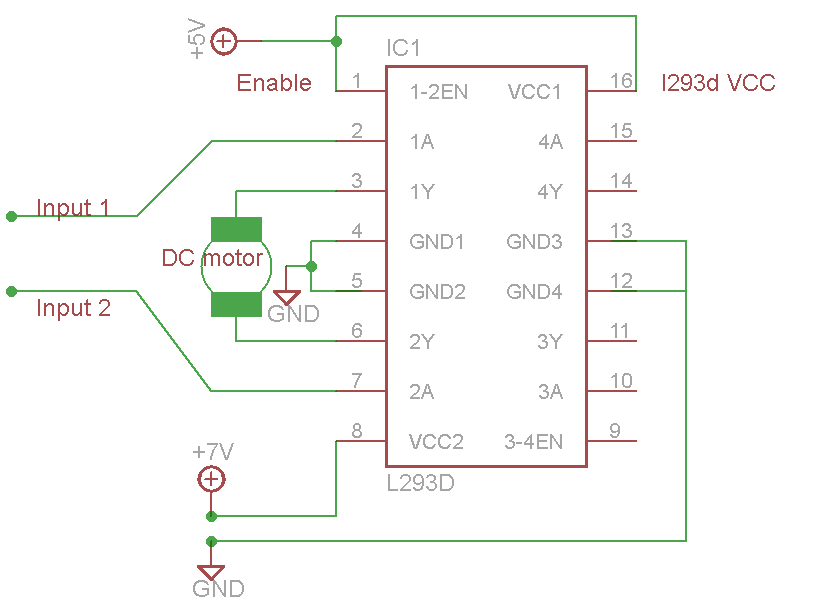

ref. lec 3/4 s.21
 

| Name | Link |
|---------------------------------|----------------------------------------------------------------------------|
|ROS Kinetic |[https://www.ros.org/](https://www.ros.org/)|
|ROS drivers* |[https://github.com/ros-drivers](https://github.com/ros-drivers)|
|Joy        * |[http://wiki.ros.org/joy](http://wiki.ros.org/joy)|
|ROS Serial * |[http://wiki.ros.org/rosserial](http://wiki.ros.org/rosserial)|
|building-a-self-balancing-robot |[/building-a-self-balancing-robot](https://ferrolho.github.io/blog/2018-04-22/building-a-self-balancing-robot) |
|mpu6050 software (not tested) |[ros-mpu6050-node](https://github.com/matpalm/ros-mpu6050-node) |
|joystick software |[joy_teleop](https://github.com/fsuarez6/labrob/blob/ca1a47f37ed0bdbfef74b4cc7a8963e4a921c143/labrob_control/scripts/joy_teleop.py) |
|Motor software |[AMSpi](https://github.com/lipoja/AMSpi) |

 

| item | quantity | price | did buy? |
|----------------|----------------|-----------------------|-----------------------|
| JMT Acrylic Plate Vehical Chassis Frame Self-balanced Mini Two-drive 2 Wheel | 1| 20 | 1 |
|L293D Motor Drive Shield  | 1| 2 | 1 |0
|raspberry pi  | 1| 35 | 1 |
|LM2596 DC-DC Buck  | 1| 2 | 0 |
|LiPo Voltage Checker  | 1| 1 | 0 |
|MPU-6050  | 1| 1 | 1 |

L298N       
mpu6050

 

| item | quantity | price | did buy? |
|----------------|----------------|-----------------------|-----------------------|
|TT Motor Smart Car Robot Gear Motor and Wheel for Arduino | 2| 2 | 0 |
|l293d / L293  | 1| 2 | 0 |
